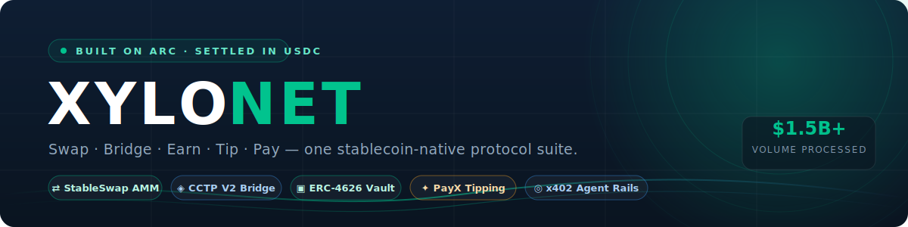
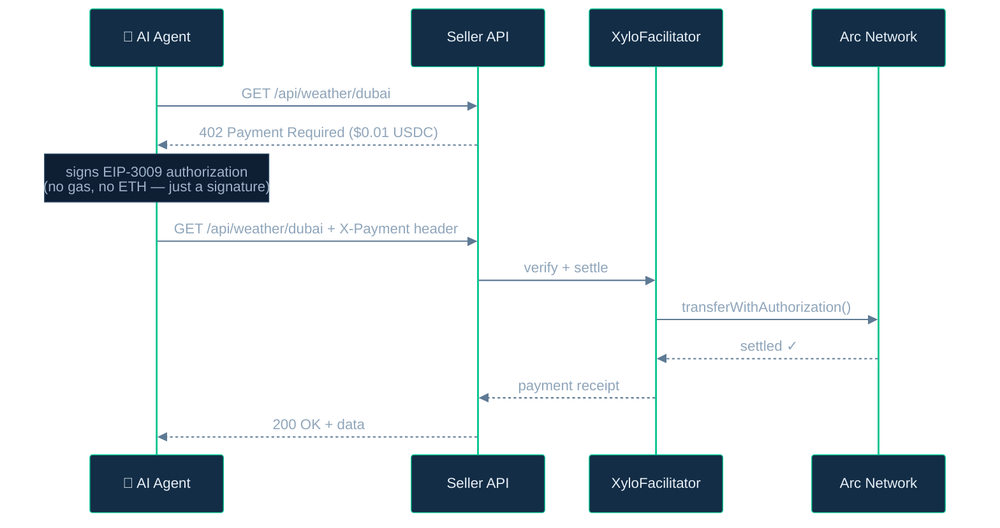
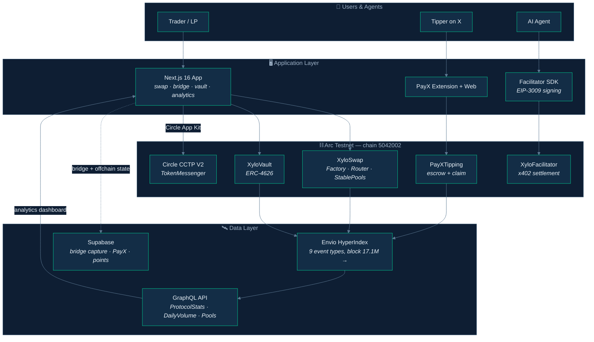

<div align="center">

<picture>
  <source media="(prefers-color-scheme: dark)" srcset=".github/assets/hero-dark.svg">
  <source media="(prefers-color-scheme: light)" srcset=".github/assets/hero-light.svg">
  
</picture>

<br/>

**[Live App](https://xylonet.xyz)** · **[Analytics](https://xylonet.xyz/analytics)** · **[Docs](https://xylonet.xyz/docs)** · **[The Suite](#-the-suite)** · **[Architecture](#-architecture)** · **[Quickstart](#-quickstart)** · **[Contracts](#-deployed-contracts)**

<br/>

[](https://testnet.arcscan.app)
[](./contracts)
[](./frontend)
[](https://developers.circle.com/stablecoins/cctp-getting-started)
[](./indexer)
[](./xylo-facilitator)
[](./LICENSE)

</div>

<br/>

> Most DeFi treats stablecoins as just another token. **XyloNet flips the frame** — it's built on [Arc](https://arc.network), a stablecoin-native L1 where gas is paid in USDC and finality is sub-second, so every product in the suite starts from the assumption that *the dollar is the unit of everything*: the asset you swap, the yield you earn, the tip you send, and the API call your AI agent pays for.

<br/>

<div align="center">
<picture>
  <source media="(prefers-color-scheme: dark)" srcset=".github/assets/stats-dark.svg">
  <source media="(prefers-color-scheme: light)" srcset=".github/assets/stats-light.svg">
  
</picture>
</div>

<sub>Every number in this README is real, on-chain, and reproducible — pulled from the [live Envio indexer](#-data--indexing) and the [public analytics dashboard](https://xylonet.xyz/analytics) on **July 8, 2026**. Nothing is mocked, estimated, or projected. Query it yourself and hold us to it.</sub>

---

## ⬡ The Suite

Five protocols, one thesis: *money that settles like a message.*

| | Protocol | One-liner | Live stats <sub>(Jul 8, 2026)</sub> |
|---|----------|-----------|------------------------------------|
| ⇄ | **[XyloSwap](#-xyloswap--the-stablecoin-amm)** | Curve-style StableSwap AMM for pegged assets | $1.50B volume · 51.09M swaps · $8.5M liquidity |
| ◈ | **[XyloBridge](#-xylobridge--native-usdc-across-19-chains)** | Native USDC to 19 chains via Circle CCTP V2 | $1.99M bridged · 6,589 transfers |
| ▣ | **[XyloVault](#-xylovault--the-erc-4626-yield-vault)** | ERC-4626 vault with decimal-agnostic accounting | $7.9M TVL · $38.8M lifetime deposits |
| ✦ | **[PayX](#-payx--usdc-tipping-for-x)** | Tip anyone on X in USDC — recipient needs no wallet | 787.5K tips · $10.9M tipped |
| ◎ | **[XyloFacilitator](#-xylofacilitator--http-402-rails-for-ai-agents)** | HTTP 402 payment rails for AI agents (EIP-3009) | Deployed + [live agent demo](./xylo-agent-demo) |

Plus the connective tissue: a **[real-time indexer](#-data--indexing)** (Envio HyperIndex), a **[production Next.js app](./frontend)** with a public analytics dashboard, and an **[autonomous agent demo](./xylo-agent-demo)** that pays for its own API calls.

---

### ⇄ XyloSwap — the stablecoin AMM

A constant-product AMM wastes depth on price ranges pegged assets never visit. XyloSwap uses the **StableSwap invariant** (amplification `A = 200`) so USDC↔EURC and USDC↔USYC trades stay tight around the peg with minimal slippage.

```
swap fee        0.04% (4 bps default, hard-capped at 1% in the contract)
invariant       StableSwap, A = 200, 2-coin pools
routing         XyloRouter — multi-hop with deadline protection
reentrancy      mutex lock on every state-changing function
live pools      USDC/EURC · USDC/USYC
```

**Real throughput:** 51,090,479 swaps totalling $1.50B, generating $110.2K in protocol fees — averaging $29.43 per swap, which tells you this is thousands of real wallets transacting, not a handful of whales inflating volume.

<sub>📁 [`contracts/src/core/`](./contracts/src/core) — `XyloFactory` · `XyloRouter` · `XyloStablePool` · `XyloERC20`</sub>

---

### ◈ XyloBridge — native USDC across 19 chains

No wrapped tokens, no liquidity pools to drain, no IOUs. XyloBridge moves **native USDC** with Circle's burn-and-mint **CCTP V2**, integrated in the frontend through the official Circle App Kit (`@circle-fin/app-kit`).

Supported testnet routes (19 chains, verified from [the bridge widget](./frontend/src/components/bridge/BridgeWidget.tsx)):

```
Arc · Ethereum Sepolia · Arbitrum Sepolia · Base Sepolia · Optimism Sepolia
Polygon Amoy · Avalanche Fuji · Linea Sepolia · Unichain Sepolia · World Chain Sepolia
Sonic · Sei · Monad · HyperEVM · Ink Sepolia · Codex · Plume · Morph · Edge
```

Where supported, Circle's Orbit relayer enables **single-signature bridging** — sign once, USDC arrives on the destination chain automatically. Every completed transfer is captured to the analytics pipeline; **$1.99M across 6,589 transfers** since tracking began July 2, 2026.

<sub>📁 [`contracts/src/bridge/`](./contracts/src/bridge) · [`frontend/src/components/bridge/`](./frontend/src/components/bridge)</sub>

---

### ▣ XyloVault — the ERC-4626 yield vault

A tokenized vault following the ERC-4626 share model, with one deliberate design choice: **decimal-agnostic accounting**. Share conversion is proportional (`shares = assets × supply / totalAssets`), never unit-fixed — so the same bytecode handles 6-decimal USDC or any other ERC-20 without redeployment.

**Lifetime flows:** $38.79M deposited, $23.62M withdrawn, **$7.91M currently at work** — measured from the live on-chain `totalAssets()`, not an internal counter, so direct transfers and accrued value are always reflected.

<sub>📁 [`contracts/src/vault/XyloVault.sol`](./contracts/src/vault/XyloVault.sol)</sub>

---

### ✦ PayX — USDC tipping for X

The unlock: **the recipient doesn't need a wallet, or even to know they were tipped.** Tips are escrowed on-chain against the *handle*, and claimed later by proving ownership of that handle via X OAuth.

```
tip  →  PayXTipping.sol escrows USDC against keccak256(handle)
claim →  recipient signs in with X → wallet linked → escrow released
```

Ships as three surfaces in the [`payx/`](./payx) monorepo: a **Chrome extension** (tip inline, right under a tweet), a **web app**, and an **Express API** that handles X OAuth and claim signatures. **787,524 tips worth $10.91M** escrowed and claimed on-chain, averaging $13.85 per tip.

<sub>📁 [`payx/apps/extension`](./payx/apps) · [`payx/apps/web`](./payx/apps) · [`payx/apps/api`](./payx/apps) · [`payx/packages/contracts`](./payx/packages) (Foundry)</sub>

---

### ◎ XyloFacilitator — HTTP 402 rails for AI agents

The HTTP status code `402 Payment Required` has been reserved since 1997. XyloFacilitator finally puts it to work — as **x402 payment infrastructure** where AI agents pay per API call in USDC, gaslessly:



The agent never holds gas — it signs an **EIP-3009 `transferWithAuthorization`** and the facilitator settles on-chain, taking a configurable basis-point fee to a treasury address. Three published packages make integration two lines of code: [`backend/`](./xylo-facilitator/backend) (the hosted facilitator, Express 5), [`packages/middleware`](./xylo-facilitator/packages) (seller-side paywall), and [`packages/sdk`](./xylo-facilitator/packages) (payer-side signing).

**See it live:** the [`xylo-agent-demo/`](./xylo-agent-demo) runs an OpenAI-powered agent against a paywalled seller API — weather at **$0.01**, summarization at **$0.02**, crypto prices at **$0.005** per call — every request settled as real USDC on Arc.

<sub>📁 Deployed: [`XyloFacilitator`](https://testnet.arcscan.app/address/0xaD4Da6Ca76703650e2f51e09CD33253141dE9c89) · [`AgentEscrow`](https://testnet.arcscan.app/address/0xf6278986838bef494368616580a6EF5aCe725f15)</sub>

---

## ⛩ Architecture



**The hybrid-data rule that keeps the numbers honest:** every protocol metric (volume, TVL, users, tips) comes exclusively from contract events aggregated *inside the indexer* — single-row `ProtocolStats` entities updated per event, never assembled from paginated samples client-side. Supabase holds only what doesn't exist on Arc: bridge transfers (executed on remote chains via CCTP), OAuth sessions, and the points system.

---

## 🗺 Monorepo Map

```
XyloNet/
├─ contracts/           ⛓  Solidity 0.8.30 — Hardhat + Foundry
│  └─ src/{core, bridge, vault, interfaces}
├─ frontend/            🖥  Next.js 16 · wagmi 2 · viem 2 · Tailwind 4 · RainbowKit
│  └─ src/app/{swap, bridge, vault, pools, analytics, payx, docs, api}
├─ indexer/             🛰  Envio HyperIndex 3.2 · GraphQL · Docker self-host option
├─ payx/                ✦  monorepo: apps/{api, web, extension} + packages/contracts
├─ xylo-facilitator/    ◎  x402 backend (Express 5) + contracts + middleware + SDK
├─ xylo-agent-demo/     🤖  OpenAI agent + paywalled seller API
└─ *.md                 📚  security policy · contributing · bridge testing guide
```

---

## 🚀 Quickstart

**Just want to use it?** → [xylonet.xyz](https://xylonet.xyz), connect a wallet, grab testnet USDC from the [Circle Faucet](https://faucet.circle.com), and you're swapping in under a minute.

**Add Arc Testnet to your wallet:**

| | |
|---|---|
| Network name | `Arc Testnet` |
| Chain ID | `5042002` |
| RPC URL | `https://rpc.testnet.arc.network` |
| Gas currency | **USDC** (yes, really) |
| Explorer | [testnet.arcscan.app](https://testnet.arcscan.app) |

**Run it yourself:**

```bash
git clone https://github.com/Panchu11/xylonet-public.git
cd xylonet-public/frontend && npm install && npm run dev   # → localhost:3000
```

<details>
<summary><b>⛓ &nbsp;Contracts</b> — compile, test, deploy</summary>

```bash
cd contracts
npm install
npx hardhat compile          # or: forge build
npx hardhat test             # or: forge test
npx hardhat run scripts/deploy.js --network arcTestnet
```

`.env` needs `PRIVATE_KEY` for deployment. Network config lives in [`hardhat.config.js`](./contracts/hardhat.config.js) (Solidity 0.8.30, Arc Testnet preconfigured with Arcscan verification).
</details>

<details>
<summary><b>🛰 &nbsp;Indexer</b> — Envio HyperIndex</summary>

```bash
cd indexer
npm install
npm run codegen              # generate types from config.yaml + schema.graphql
npm run dev                  # local run (requires Docker)
```

Indexes 5 contracts / 9 event types from block **17,100,000**. Self-hosting via the included [`Dockerfile`](./indexer/Dockerfile) + [`docker-compose.yml`](./indexer/docker-compose.yml), or deploy to Envio's hosted service. See [`indexer/DEPLOYMENT.md`](./indexer/DEPLOYMENT.md).
</details>

<details>
<summary><b>◎ &nbsp;XyloFacilitator</b> — x402 backend</summary>

```bash
cd xylo-facilitator/backend
npm install
npm run dev                  # node --watch
npm test
```

Apply `supabase-migration-001.sql` → `004` for the database schema. Integrate as a seller with `packages/middleware`, or as a payer with `packages/sdk`.
</details>

<details>
<summary><b>✦ &nbsp;PayX</b> — tipping monorepo</summary>

```bash
cd payx
npm install                  # all workspaces
npm run build:contracts      # Foundry
npm run dev:api              # Express backend (X OAuth)
npm run dev:web              # web app
```

The Chrome extension lives in `apps/extension` — load it unpacked via `chrome://extensions`.
</details>

<details>
<summary><b>🤖 &nbsp;Agent demo</b> — watch an AI pay its own bills</summary>

```bash
cd xylo-agent-demo
./setup.ps1                  # installs deps, creates .env, generates agent wallet

cd seller-api && npm run dev # terminal 1 — paywalled API
cd agent && npm start        # terminal 2 — the agent
```

Requires an OpenAI API key, a running facilitator, and a few testnet cents in the agent wallet.
</details>

---

## 📜 Deployed Contracts

All addresses live on **Arc Testnet** (`5042002`) and verifiable on [Arcscan](https://testnet.arcscan.app):

| Contract | Address |
|----------|---------|
| XyloFactory | [`0x60EDeFB094B84BBC6430cc130B358A43Ba1979e2`](https://testnet.arcscan.app/address/0x60EDeFB094B84BBC6430cc130B358A43Ba1979e2) |
| XyloRouter | [`0x73742278c31a76dBb0D2587d03ef92E6E2141023`](https://testnet.arcscan.app/address/0x73742278c31a76dBb0D2587d03ef92E6E2141023) |
| USDC/EURC Pool | [`0x3DF3966F5138143dce7a9cFDdC2c0310ce083BB1`](https://testnet.arcscan.app/address/0x3DF3966F5138143dce7a9cFDdC2c0310ce083BB1) |
| USDC/USYC Pool | [`0x8296cC7477A9CD12cF632042fDDc2aB89151bb61`](https://testnet.arcscan.app/address/0x8296cC7477A9CD12cF632042fDDc2aB89151bb61) |
| XyloVault | [`0x240Eb85458CD41361bd8C3773253a1D78054f747`](https://testnet.arcscan.app/address/0x240Eb85458CD41361bd8C3773253a1D78054f747) |
| XyloBridge | [`0xf7Df65Ce418E938ee8d9a0A0d227A43441fe4641`](https://testnet.arcscan.app/address/0xf7Df65Ce418E938ee8d9a0A0d227A43441fe4641) |
| PayXTipping | [`0xA312c384770B7b49E371DF4b7AF730EFEF465913`](https://testnet.arcscan.app/address/0xA312c384770B7b49E371DF4b7AF730EFEF465913) |
| XyloFacilitator | [`0xaD4Da6Ca76703650e2f51e09CD33253141dE9c89`](https://testnet.arcscan.app/address/0xaD4Da6Ca76703650e2f51e09CD33253141dE9c89) |
| AgentEscrow | [`0xf6278986838bef494368616580a6EF5aCe725f15`](https://testnet.arcscan.app/address/0xf6278986838bef494368616580a6EF5aCe725f15) |

<details>
<summary><b>Tokens & Circle infrastructure</b></summary>

| Token / Contract | Address | Notes |
|------------------|---------|-------|
| USDC (native) | `0x3600000000000000000000000000000000000000` | 6 decimals, also the gas token |
| EURC | `0x89B50855Aa3bE2F677cD6303Cec089B5F319D72a` | 6 decimals |
| USYC | `0xe9185F0c5F296Ed1797AaE4238D26CCaBEadb86C` | 6 decimals |
| CCTP TokenMessenger | `0x8FE6B999Dc680CcFDD5Bf7EB0974218be2542DAA` | Circle CCTP V2 |
| CCTP MessageTransmitter | `0xE737e5cEBEEBa77EFE34D4aa090756590b1CE275` | Circle CCTP V2 |

</details>

---

## 🛰 Data & Indexing

The analytics you see at [xylonet.xyz/analytics](https://xylonet.xyz/analytics) are produced by a purpose-built pipeline, not a third-party widget:

- **Envio HyperIndex** ingests `Swap`, `AddLiquidity`, `RemoveLiquidity`, `RemoveLiquidityOne`, `Deposit`, `Withdraw`, `TipSent`, `TipsClaimed`, and `PoolCreated` from block 17.1M onward.
- **Aggregates are computed at write time** — `ProtocolStats` (lifetime totals), `DailyVolume`, `PoolDailyVolume`, and `ProtocolUser` entities are updated per event, so the dashboard reads exact totals in one query with zero pagination.
- **Live on-chain reads** (pool reserves, vault `totalAssets()`) top up the indexed data with current-block state.
- **Resilience by design:** the dashboard never renders a fabricated number — if a data source fails, it serves the last known-good snapshot and says so, rather than silently showing zeros.

Full protocol snapshot as of **July 8, 2026**:

| Metric | Value | | Metric | Value |
|--------|------:|-|--------|------:|
| All-time swap volume | $1.50B | | Vault TVL (live) | $7.91M |
| Swaps executed | 51,090,479 | | Vault lifetime deposits | $38.79M |
| Unique wallets | 1,628,722 | | Vault lifetime withdrawals | $23.62M |
| Protocol fee revenue | $110,179 | | Tips sent | 787,524 |
| Total value locked | $16.42M | | Tip volume | $10.91M |
| 24h volume | $6.68M | | Bridge volume <sub>(since Jul 2)</sub> | $1.99M |
| Avg swap size | $29.43 | | Bridge transfers | 6,589 |

---

## 🛡 Security

**Contract layer** — Solidity 0.8.30 with checked arithmetic throughout; a mutex `lock` modifier guards every state-changing pool function; all swaps and liquidity operations enforce user-supplied deadlines against stale execution; pool fees are hard-capped at 1% in the bytecode.

**Payments layer** — bridge transfers are Circle-native burn-and-mint (no wrapped-asset honeypot to drain); x402 settlements use EIP-3009 signed authorizations with nonce-based replay protection, verified on-chain before any funds move.

**Off-chain layer** — Supabase tables run with row-level security; the facilitator settles from an isolated key with a configurable fee to a treasury address.

Found something? See [SECURITY.md](./SECURITY.md) for responsible disclosure.

---

## 📚 Documentation

| Read this... | ...if you want |
|--------------|----------------|
| [xylonet.xyz/docs](https://xylonet.xyz/docs) | Full product documentation — swap, bridge, vault, pools, network |
| [BRIDGE_TESTING_GUIDE.md](./BRIDGE_TESTING_GUIDE.md) | Hands-on CCTP bridge walkthrough |
| [SECURITY.md](./SECURITY.md) | Security policy and responsible disclosure |
| Module READMEs | Deep dives: [`contracts`](./contracts/README.md) · [`frontend`](./frontend/README.md) · [`indexer`](./indexer/README.md) · [`payx`](./payx/README.md) · [`xylo-facilitator`](./xylo-facilitator/README.md) · [`xylo-agent-demo`](./xylo-agent-demo/README.md) |

**External:** [Arc docs](https://docs.arc.network) · [CCTP docs](https://developers.circle.com/stablecoins/cctp-getting-started) · [Envio docs](https://docs.envio.dev) · [EIP-3009](https://eips.ethereum.org/EIPS/eip-3009) · [EIP-4626](https://eips.ethereum.org/EIPS/eip-4626)

---

## 🤝 Contributing

PRs welcome — read [CONTRIBUTING.md](./CONTRIBUTING.md) first. The short version: fork → feature branch → make `npm run lint` and `npm run build` pass → open a PR. Contracts follow Foundry formatting; the frontend is strict-mode TypeScript.

## ⚖ License

[MIT](./LICENSE) © XyloNet

<br/>

<div align="center">

**Built on [Arc](https://arc.network) · Powered by [Circle](https://circle.com) · Indexed by [Envio](https://envio.dev)**

<sub>⬡ &nbsp;If stablecoins are going to move the world's money, the rails deserve to be this good.&nbsp; ⬡</sub>

</div>
