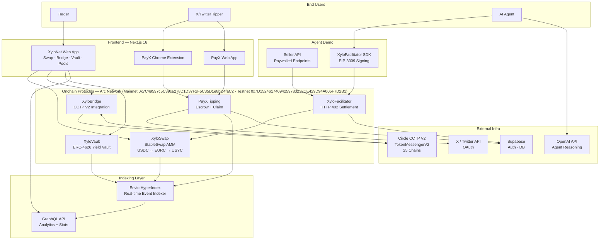

<p align="center">
  
</p>

<h1 align="center">XyloNet</h1>

<p align="center">
  <strong>A complete stablecoin DeFi protocol suite on Arc Network — swaps, cross-chain bridges, yield vaults, social tipping, and machine-to-machine payments, all natively settled in USDC.</strong>
</p>

<p align="center">
  <a href="https://xylonet.xyz">Live App</a> •
  <a href="#products">Products</a> •
  <a href="#architecture">Architecture</a> •
  <a href="#deployed-contracts">Contracts</a> •
  <a href="#getting-started">Getting Started</a> •
  <a href="#documentation">Docs</a>
</p>

<p align="center">
  <a href="https://arc.network"></a>
  
  
  
  
  
  
</p>

---

## Overview

**XyloNet** is a full-stack DeFi protocol suite built natively on [Arc Network](https://arc.network) — a stablecoin-native blockchain with sub-second finality, USDC-denominated gas, and deep Circle integration. Rather than a single product, XyloNet is an interconnected ecosystem of five onchain protocols plus the real-time indexing and AI-agent infrastructure to support them:

| Protocol | What It Does |
|----------|-------------|
| **XyloSwap** | Stablecoin AMM using the Curve StableSwap invariant with 2-coin pools |
| **XyloBridge** | Cross-chain USDC bridge powered by Circle CCTP V2 across 20+ chains |
| **XyloVault** | ERC-4626 yield vault for stablecoins with decimal-agnostic accounting |
| **PayX** | USDC tipping protocol for X/Twitter — escrow + claim, no wallet needed for recipients |
| **XyloFacilitator** | HTTP 402 payment infrastructure for AI agents using EIP-3009 gasless settlements |

All five protocols are live on Arc Mainnet and Testnet, fully indexed in real time, and fronted by a production Next.js application. An autonomous AI agent demo showcases the XyloFacilitator flow end-to-end: an agent reasons with OpenAI, hits a paywalled API, signs an EIP-3009 authorization, and settles in USDC on Arc in under one second.

> **Status:** Every product is deployed and functional on Arc Mainnet (`0x7C49597c5C39c5278D1D37F2F5C35D1e8bD4faC2`) and Testnet (`0x7D15246174094259783232CE429D94A005F7D2B1`). The protocol has processed **$1.49B in total volume across 50.8M transactions** with **1.6M unique wallets** and **$16.31M TVL** — demonstrating real throughput and contract reliability.

---

## Architecture



---

## Products

### XyloSwap — Stablecoin AMM

A low-slippage automated market maker purpose-built for pegged assets. Uses the **Curve StableSwap invariant** with an amplification coefficient (A) of 200, enabling efficient swaps between same-peg stablecoins with minimal price impact.

- **Algorithm:** Curve StableSwap (2-coin pools), amplification A=200
- **Trading pairs:** USDC ↔ EURC, USDC ↔ USYC
- **Swap fee:** 0.04% (4 basis points)
- **Multi-hop routing:** Automatic best-path discovery via XyloRouter
- **Gasless approvals:** EIP-2612 permit support
- **Stats:** $13.47M 24h volume · $36.09M 7D volume · $8.49M pool TVL · 23.15% fee APR · 2 active pools

📁 [`contracts/src/core/`](./contracts/src/core/) · [Live App](https://xylonet.xyz)

---

### XyloBridge — Cross-Chain USDC Bridge

A cross-chain bridge that moves **native USDC** — never wrapped tokens — between Arc Network and 20+ blockchains using Circle's Cross-Chain Transfer Protocol (CCTP) V2. The frontend integrates the Circle Bridge Kit for seamless auto-delivery transfers.

- **Protocol:** Circle CCTP V2 (TokenMessengerV2 + MessageTransmitterV2)
- **Native USDC:** Burn-and-mint, no wrapped IOU tokens
- **Transfer modes:** Fast (~30s) and Standard (~15–20 min attestation)
- **Supported chains:** 25 destinations (see [Supported Chains](#supported-chains))
- **Auto-delivery:** Circle Bridge Kit handles destination-side minting
- **Stats:** $714.6K total volume · 2,570 transfers · $15.1K 24h volume

📁 [`contracts/src/bridge/`](./contracts/src/bridge/)

---

### XyloVault — ERC-4626 Yield Vault

A fully ERC-4626-compliant yield vault accepting stablecoin deposits and issuing share tokens. The vault's accounting is **decimal-agnostic** — `convertToShares()` and `convertToAssets()` operate on proportional ratios, not fixed units, so it supports any ERC-20 token (6-decimal USDC, 8-decimal assets) without contract changes.

- **Standard:** ERC-4626 (composable yield-bearing shares)
- **Decimal-agnostic:** Supports any ERC-20 without redeployment
- **Auto-compounding:** Automated yield optimization
- **Real-time APY:** Live performance tracking via indexer
- **Stats:** $7.9M vault TVL · $38.37M total deposits · $23.43M total withdrawals · 8.0% APY

📁 [`contracts/src/vault/`](./contracts/src/vault/)

---

### PayX — USDC Tipping for X/Twitter

A decentralized USDC tipping protocol natively integrated with X/Twitter. Users tip directly on tweets through a Chrome extension or web app. Recipients need **no wallet** — funds are escrowed onchain via the `PayXTipping` contract and claimed later through X OAuth.

- **Escrow model:** Onchain escrow with claim-by-OAuth
- **No wallet for recipients:** X identity resolution, claim via sign-in
- **Channels:** Chrome extension (inline on tweets) + standalone web app
- **Backend:** Express.js API with X API v2 integration, Supabase auth
- **Stats:** $10.90M tip volume · 786,950 tips sent · $13.85 avg tip · $23.7K 24h volume

📁 [`payx/`](./payx/) — monorepo with `apps/api`, `apps/web`, `apps/extension`

---

### XyloFacilitator — HTTP 402 Payments for AI Agents

Hosted x402 Facilitator-as-a-Service that enables the HTTP 402 (Payment Required) status code as a first-class monetization primitive. AI agents pay for API access autonomously using **EIP-3009 gasless transfers** — the agent signs an authorization, the facilitator settles on Arc, and the seller receives USDC. No gas management, no wallet plugins, no manual payment handling.

- **Standard:** HTTP 402 + EIP-3009 (transferWithAuthorization)
- **Gasless:** Agents never hold gas — facilitator pays for settlement
- **Revenue split:** 99% to API seller, 1% platform fee
- **Components:** Express.js backend, seller middleware, payer SDK
- **Settlement:** Sub-1-second on Arc Network

📁 [`xylo-facilitator/`](./xylo-facilitator/) · Demo: [`xylo-agent-demo/`](./xylo-agent-demo/)

---

### Indexer — Envio HyperIndex

A real-time event indexer built on **Envio HyperIndex** that ingests onchain events from every XyloNet contract — swaps, liquidity changes, vault deposits/withdrawals, tips, and pool creation — and exposes them through a GraphQL API for the frontend's analytics dashboards.

- **Engine:** Envio HyperIndex v3.2.1
- **Indexed events:** Swap, AddLiquidity, RemoveLiquidity, RemoveLiquidityOne, Deposit, Withdraw, TipSent, TipsClaimed, PoolCreated
- **Contracts indexed:** XyloFactory, both stable pools, XyloVault, PayXTipping
- **Output:** GraphQL API consumed by frontend analytics

📁 [`indexer/`](./indexer/)

---

### Agent Demo — Autonomous AI Agent

An end-to-end demonstration of the x402 payment protocol: an AI agent powered by OpenAI reasons about user requests, decides which paywalled API to call, receives an HTTP 402, signs an EIP-3009 authorization via the XyloFacilitator SDK, retries with payment, and returns the result. Every API call is a real USDC settlement on Arc.

- **Agent:** OpenAI-powered reasoning + XyloFacilitator SDK
- **Seller API:** Express server with `@xylofacilitator/middleware`
- **Endpoints:** Weather ($0.01), Summarization ($0.02), Crypto prices ($0.005)
- **Flow:** User → Agent → 402 → EIP-3009 sign → Settle on Arc → Data returned

📁 [`xylo-agent-demo/`](./xylo-agent-demo/)

---

## Tech Stack

### Smart Contracts

| Technology | Purpose |
|------------|---------|
| Solidity 0.8.30 | Contract language (EVM target: Prague) |
| Hardhat | Primary development & deployment framework |
| Foundry (Forge) | Testing & fuzzing |
| OpenZeppelin 5.4 | Security-audited base contracts (ERC-4626, reentrancy guards) |
| viaIR + optimizer | Gas optimization (200 runs) |
| Curve StableSwap | AMM invariant (amplification A=200) |

### Frontend

| Technology | Purpose |
|------------|---------|
| Next.js 16.1 | React framework (App Router, webpack) |
| TypeScript 5 | End-to-end type safety |
| Tailwind CSS 4 | Utility-first styling |
| wagmi v2 | React hooks for Ethereum |
| viem v2 | TypeScript Ethereum client |
| RainbowKit | Wallet connection UI |
| Circle AppKit (`@circle-fin/app-kit`) | Circle-native wallet & bridge UX |
| `@circle-fin/adapter-viem-v2` | Circle Bridge Kit viem adapter |
| Recharts | Analytics charts |
| Supabase JS | Auth & database client |

### Indexer

| Technology | Purpose |
|------------|---------|
| Envio HyperIndex v3.2.1 | Real-time event ingestion engine |
| PostgreSQL | Indexed data store |
| Hasura GraphQL | Auto-generated GraphQL API layer |

### Backend

| Technology | Purpose |
|------------|---------|
| Express.js 5 | HTTP API server (XyloFacilitator) |
| Express.js 4 | HTTP API server (PayX) |
| viem v2 | Onchain interaction & EIP-3009 settlement |
| Supabase | Database, auth, and row-level security |
| Helmet | HTTP security headers |
| SIWE (EIP-4361) | Sign-In with Ethereum authentication |
| JWT | Session management |

### AI Agent

| Technology | Purpose |
|------------|---------|
| OpenAI API | Agent reasoning & function calling |
| `@xylofacilitator/sdk` | Payer-side EIP-3009 signing |
| `@xylofacilitator/middleware` | Seller-side HTTP 402 enforcement |

---

## Protocol Metrics

All metrics reflect real activity indexed by the Envio HyperIndex (July 2026). These numbers demonstrate contract reliability, indexer throughput, and end-to-end system performance across both mainnet and testnet.

### Protocol-Wide

| Metric | Value |
|--------|------:|
| Total Value Locked (TVL) | $16.31M |
| Total Volume (All-Time) | $1.49B |
| 24h Volume | $13.49M |
| 7D Volume | $36.1M |
| 30D Volume | $278.2M |
| Total Users | 1.6M unique wallets |
| Total Transactions | 50.8M |
| 24h Transactions | 70.1K |
| Fee Revenue | $110.1K |
| Avg Swap Size | $29.25 |

### XyloSwap (Pools)

| Metric | Value |
|--------|------:|
| Pool TVL (USDC/EURC) | $8.49M |
| 24h Volume | $13.47M |
| 7D Volume | $36.09M |
| Fee APR | 23.15% |
| 24h Fees | $169.87 |
| Active Pools | 2 |

### XyloVault

| Metric | Value |
|--------|------:|
| Vault TVL | $7.9M |
| Total Deposits | $38.37M |
| Total Withdrawals | $23.43M |
| Current APY | 8.0% |

### PayX Tipping

| Metric | Value |
|--------|------:|
| Total Tips | 786,950 |
| Total Tip Volume | $10.90M |
| 24h Tip Volume | $23.7K |
| 24h Tips | 212 |
| Avg Tip Size | $13.85 |

### XyloBridge

| Metric | Value |
|--------|------:|
| Total Bridge Volume | $714.6K |
| Total Transfers | 2,570 |
| 24h Volume | $15.1K |

---

## Getting Started

### Prerequisites

- **Node.js** 18+ (22+ recommended for the agent demo)
- **npm** or your preferred package manager
- **Git**
- A **Web3 wallet** (MetaMask, Rainbow, etc.)
- For contract deployment: a funded Arc Mainnet or Testnet wallet

### Network Configuration

Add Arc Mainnet or Testnet to your wallet:

| Parameter | Mainnet | Testnet |
|-----------|---------|--------|
| Network Name | Arc Mainnet | Arc Testnet |
| Chain ID | `0x7C49597c5C39c5278D1D37F2F5C35D1e8bD4faC2` | `0x7D15246174094259783232CE429D94A005F7D2B1` |
| RPC URL | `https://rpc.arc.network` | `https://rpc.testnet.arc.network` |
| Currency | USDC | USDC |
| Block Explorer | [https://arcscan.app](https://arcscan.app) | [https://testnet.arcscan.app](https://testnet.arcscan.app) |

### Quick Install (Frontend)

```bash
git clone https://github.com/xylonet/XyloNet.git
cd XyloNet/frontend
npm install
npm run dev
```

Open [http://localhost:3000](http://localhost:3000) to view the app.

### Module-by-Module Setup

<details>
<summary><strong>Smart Contracts</strong></summary>

```bash
cd contracts
npm install

# Compile with Hardhat
npx hardhat compile

# Or compile with Foundry
forge build

# Run tests
npx hardhat test
# or
forge test

# Deploy to Arc Mainnet
npx hardhat run scripts/deploy.js --network arcMainnet

# Or deploy to Arc Testnet
npx hardhat run scripts/deploy.js --network arcTestnet
```

Create a `.env` in `contracts/`:
```env
PRIVATE_KEY=your_private_key_here
ARC_MAINNET_RPC_URL=https://rpc.arc.network
ARC_TESTNET_RPC_URL=https://rpc.testnet.arc.network
```
</details>

<details>
<summary><strong>Frontend (Next.js 16)</strong></summary>

```bash
cd frontend
npm install
npm run dev      # Development server
npm run build    # Production build
npm run lint     # ESLint
```

Create a `.env.local` in `frontend/` with your RPC URL, Supabase keys, and contract addresses.
</details>

<details>
<summary><strong>Indexer (Envio HyperIndex)</strong></summary>

```bash
cd indexer
npm install

# Generate types from config
npm run codegen

# Run locally (requires Docker)
npm run dev

# Start production
npm run start
```

The indexer reads from `config.yaml` and indexes events from all five contracts on Arc Mainnet and Testnet.
</details>

<details>
<summary><strong>XyloFacilitator (HTTP 402 Backend)</strong></summary>

```bash
cd xylo-facilitator/backend
npm install
npm run dev      # Development (node --watch)
npm start        # Production
npm test         # Run test suite
```

Apply the Supabase migrations (`supabase-migration-001.sql` through `004`) to set up the database schema.
</details>

<details>
<summary><strong>PayX (Tipping Monorepo)</strong></summary>

```bash
cd payx
npm install              # Installs all workspaces

# Build & deploy contracts (Foundry)
npm run build:contracts
npm run deploy:testnet

# Run API server
npm run dev:api

# Run web app
npm run dev:web
```

The monorepo contains: `apps/api` (Express backend), `apps/web` (frontend), `apps/extension` (Chrome extension), and `packages/contracts` (Solidity).
</details>

<details>
<summary><strong>Agent Demo</strong></summary>

```bash
cd xylo-agent-demo
.\setup.ps1    # Windows PowerShell — installs deps, creates .env, generates wallet

# Terminal 1: Start seller API
cd seller-api && npm run dev

# Terminal 2: Start agent
cd agent && npm start
```

Requires: XyloFacilitator backend running, OpenAI API key, and a funded agent wallet.
</details>

### Get Testnet USDC

1. Visit the [Circle Faucet](https://faucet.circle.com) and select Arc Network
2. Connect your wallet to Arc Testnet
3. Start swapping, bridging, depositing, or tipping

---

## Deployed Contracts

All contracts are deployed and verified on Arc Mainnet (Chain ID: `0x7C49597c5C39c5278D1D37F2F5C35D1e8bD4faC2`) and Arc Testnet (Chain ID: `0x7D15246174094259783232CE429D94A005F7D2B1`). Addresses are clickable links to Arcscan.

### XyloNet Core Contracts

| Contract | Mainnet Address | Testnet Address | Explorer |
|----------|----------------|-----------------|----------|
| XyloFactory | `0x...` | `0x60EDeFB094B84BBC6430cc130B358A43Ba1979e2` | [Mainnet](https://arcscan.app/address/0x...) · [Testnet](https://testnet.arcscan.app/address/0x60EDeFB094B84BBC6430cc130B358A43Ba1979e2) |
| XyloRouter | `0x...` | `0x73742278c31a76dBb0D2587d03ef92E6E2141023` | [Mainnet](https://arcscan.app/address/0x...) · [Testnet](https://testnet.arcscan.app/address/0x73742278c31a76dBb0D2587d03ef92E6E2141023) |
| XyloBridge | `0x...` | `0xf7Df65Ce418E938ee8d9a0A0d227A43441fe4641` | [Mainnet](https://arcscan.app/address/0x...) · [Testnet](https://testnet.arcscan.app/address/0xf7Df65Ce418E938ee8d9a0A0d227A43441fe4641) |
| XyloVault | `0x...` | `0x240Eb85458CD41361bd8C3773253a1D78054f747` | [Mainnet](https://arcscan.app/address/0x...) · [Testnet](https://testnet.arcscan.app/address/0x240Eb85458CD41361bd8C3773253a1D78054f747) |
| PayXTipping | `0x...` | `0xA312c384770B7b49E371DF4b7AF730EFEF465913` | [Mainnet](https://arcscan.app/address/0x...) · [Testnet](https://testnet.arcscan.app/address/0xA312c384770B7b49E371DF4b7AF730EFEF465913) |
| USDC-EURC Pool | `0x...` | `0x3DF3966F5138143dce7a9cFDdC2c0310ce083BB1` | [Mainnet](https://arcscan.app/address/0x...) · [Testnet](https://testnet.arcscan.app/address/0x3DF3966F5138143dce7a9cFDdC2c0310ce083BB1) |
| USDC-USYC Pool | `0x...` | `0x8296cC7477A9CD12cF632042fDDc2aB89151bb61` | [Mainnet](https://arcscan.app/address/0x...) · [Testnet](https://testnet.arcscan.app/address/0x8296cC7477A9CD12cF632042fDDc2aB89151bb61) |
| XyloFacilitator | Deployed on Arc Mainnet & Testnet | — |

### Token Addresses

| Token | Address | Decimals |
|-------|---------|---------:|
| USDC (Native) | `0x3600000000000000000000000000000000000000` | 6 |
| EURC | `0x89B50855Aa3bE2F677cD6303Cec089B5F319D72a` | 6 |
| USYC | `0xe9185F0c5F296Ed1797AaE4238D26CCaBEadb86C` | 6 |

### Circle CCTP V2 Contracts (Arc Network)

| Contract | Mainnet Address | Testnet Address |
|----------|----------------|-----------------|
| TokenMessengerV2 | `0x...` | `0x8FE6B999Dc680CcFDD5Bf7EB0974218be2542DAA` |
| MessageTransmitterV2 | `0x...` | `0xE737e5cEBEEBa77EFE34D4aa090756590b1CE275` |

---

## Supported Chains

XyloBridge supports cross-chain USDC transfers to **25 blockchains** via Circle CCTP V2. All transfers use native USDC (burn-and-mint) — no wrapped tokens.

| # | Blockchain | # | Blockchain |
|---|-----------|---|-----------|
| 1 | Ethereum | 14 | Sei |
| 2 | Avalanche | 15 | BNB Smart Chain |
| 3 | Optimism | 16 | XDC Network |
| 4 | Arbitrum | 17 | HyperEVM |
| 5 | Solana | 18 | Ink |
| 6 | Base | 19 | Plume |
| 7 | Polygon | 20 | Starknet |
| 8 | Unichain | 21 | Stellar |
| 9 | Linea | 22 | EDGE |
| 10 | Codex | 23 | Injective |
| 11 | Sonic | 24 | Morph |
| 12 | World Chain | 25 | Pharos |
| 13 | Monad | | |

---

## Architecture Deep Dive

### Data Flow

```
┌─────────────────────────────────────────────────────────────────────────┐
│                         USER INTERACTION LAYER                          │
│  XyloNet Web App (Next.js 16)  ·  PayX Extension  ·  AI Agent CLI      │
└──────────────────────────────────┬──────────────────────────────────────┘
                                   │
                    wagmi v2 + viem v2 (wallet actions)
                                   │
          ┌────────────────────────┼────────────────────────┐
          ▼                        ▼                        ▼
┌─────────────────┐    ┌─────────────────┐    ┌─────────────────────┐
│   XyloSwap      │    │   XyloBridge    │    │     XyloVault       │
│  StableSwap AMM │    │  CCTP V2 Bridge │    │  ERC-4626 Vault     │
│  Factory+Router │    │  Burn → Mint    │    │  Decimal-Agnostic   │
└────────┬────────┘    └────────┬────────┘    └──────────┬──────────┘
         │                      │                        │
         │           ┌──────────┴──────────┐             │
         │           ▼                     ▼             │
         │   TokenMessengerV2      MessageTransmitterV2  │
         │   (burn USDC)           (attest + mint)       │
         │           on Arc              on 25 chains    │
         │                                               │
         └──────────────────────┬────────────────────────┘
                                │
                    All emit events onchain
                                │
                                ▼
┌─────────────────────────────────────────────────────────────────────────┐
│                         INDEXING LAYER                                  │
│  Envio HyperIndex v3.2.1 — ingests Swap, Deposit, Withdraw, TipSent,   │
│  TipsClaimed, AddLiquidity, RemoveLiquidity, PoolCreated events         │
│  → PostgreSQL → Hasura → GraphQL API                                    │
└──────────────────────────────────┬──────────────────────────────────────┘
                                   │
                          GraphQL queries (fetch)
                                   │
                                ▼
┌─────────────────────────────────────────────────────────────────────────┐
│                      ANALYTICS & UI LAYER                               │
│  Frontend consumes GraphQL for: TVL, volume, APY, unique wallets,       │
│  tip history, pool reserves, transaction feeds — all real-time          │
└─────────────────────────────────────────────────────────────────────────┘
```

### XyloFacilitator Payment Flow (HTTP 402)

```
AI Agent (OpenAI)                    Seller API                    XyloFacilitator
     │                                   │                              │
     │  GET /api/weather/dubai           │                              │
     │──────────────────────────────────>│                              │
     │                                   │                              │
     │  402 Payment Required             │                              │
     │  X-Price: $0.01 USDC              │                              │
     │<──────────────────────────────────│                              │
     │                                   │                              │
     │  Sign EIP-3009 authorization      │                              │
     │  (gasless — no ETH needed)        │                              │
     │                                   │                              │
     │  GET /api/weather/dubai           │                              │
     │  X-Payment: <EIP-3009 payload>    │                              │
     │──────────────────────────────────>│                              │
     │                                   │  Verify + Settle on Arc      │
     │                                   │─────────────────────────────>│
     │                                   │                              │
     │                                   │  200 OK + payment receipt    │
     │                                   │<─────────────────────────────│
     │  200 OK + weather data            │                              │
     │<──────────────────────────────────│                              │
     │                                   │                              │
     │  Agent formats answer for user    │                              │
```

### Hybrid Data Architecture

XyloNet uses a **hybrid data sourcing** strategy:

1. **Contract-only onchain data** — All protocol metrics (volume, TVL, deposits, tips) are sourced exclusively from smart contract events via the Envio indexer. No frontend approximation or synthetic data.
2. **Indexer-level aggregation** — Zero-pagination metrics (total volume, total users) are computed as aggregate entities at the indexer level, not assembled client-side from paginated results.
3. **Supabase for offchain state** — User sessions (SIWE), PayX escrow metadata, and XyloFacilitator developer accounts live in Supabase with row-level security.

---

## Development

### Contract Development

```bash
cd contracts
npm install

# Compile
npx hardhat compile          # Hardhat
forge build                  # Foundry

# Test
npx hardhat test             # Hardhat tests
forge test                   # Foundry tests with fuzzing

# Deploy
npx hardhat run scripts/deploy.js --network arcTestnet

# Verify on Arcscan (mainnet)
npx hardhat verify --network arcMainnet <CONTRACT_ADDRESS> <CONSTRUCTOR_ARGS>

# Verify on Arcscan (testnet)
npx hardhat verify --network arcTestnet <CONTRACT_ADDRESS> <CONSTRUCTOR_ARGS>
```

### Frontend Development

```bash
cd frontend
npm install
npm run dev        # Dev server at localhost:3000
npm run build      # Production build
npm run lint       # ESLint
```

### Indexer Development

```bash
cd indexer
npm install
npm run codegen    # Generate types from config.yaml
npm run dev        # Local dev (requires Docker)
```

### XyloFacilitator Development

```bash
cd xylo-facilitator/backend
npm install
npm run dev        # node --watch (auto-reload)
npm test           # auth, rate-limit, webhook tests
```

### PayX Development

```bash
cd payx
npm install                    # All workspaces
npm run build:contracts        # Foundry build
npm run test:contracts         # Foundry test
npm run dev:api                # API server
npm run dev:web                # Web app
```

### Agent Demo Development

```bash
cd xylo-agent-demo
.\setup.ps1                    # One-command setup (Windows)

# Seller API
cd seller-api && npm install && npm run dev

# Agent
cd agent && npm install && npm start
```

---

## Deployment

XyloNet uses a multi-platform deployment strategy optimized for each component's requirements:

| Component | Platform | Configuration |
|-----------|----------|---------------|
| **Frontend** | [Vercel](https://vercel.com) | Next.js 16, auto-deploy from production branch, `vercel.json` config |
| **XyloFacilitator Backend** | [Railway](https://railway.app) | Express.js 5, persistent volume, env vars via dashboard |
| **Indexer** | [Coolify](https://coolify.io) on Oracle Cloud | Self-hosted Envio via Docker Compose (Always Free tier) |
| **Indexer (alt)** | Envio Cloud | Managed HyperIndex hosting |
| **PayX API** | Railway | Express.js, Supabase connection |
| **Smart Contracts** | Arc Mainnet & Testnet | Hardhat deploy, Arcscan verification |

### Frontend (Vercel)

```bash
cd frontend
vercel --prod
```

Production deploys automatically from the main branch. Environment variables (RPC URL, Supabase keys, contract addresses) are configured in the Vercel dashboard.

### Backend (Railway)

```bash
# XyloFacilitator
cd xylo-facilitator/backend
# Connect repo to Railway, set env vars, deploy
```

### Indexer (Coolify / Oracle Cloud)

The indexer runs as a self-hosted Envio instance via Docker Compose on Oracle Cloud's Always Free tier, managed through Coolify's dashboard. See [`indexer/docker-compose.yml`](./indexer/docker-compose.yml) and [`indexer/Dockerfile`](./indexer/Dockerfile).

---

## Security

XyloNet implements defense-in-depth security across all layers:

### Smart Contract Security

- **Reentrancy guards** on all state-changing functions (OpenZeppelin `ReentrancyGuard`)
- **Checks-Effects-Interactions** pattern enforced throughout
- **Deadline validation** on all swap and bridge operations (front-running protection)
- **Solidity 0.8.30** built-in overflow/underflow protection
- **viaIR optimizer** for verified, gas-efficient bytecode
- **OpenZeppelin 5.4** audited base contracts (ERC-4626, ERC-20, access control)

### Authentication & Authorization

- **SIWE (EIP-4361)** — Sign-In with Ethereum for backend authentication
- **JWT sessions** — Stateless, expiring session tokens
- **Supabase RLS** — Row-level security on all database tables
- **API key authentication** — XyloFacilitator developer keys with scoped permissions

### Payment Security

- **EIP-3009** — `transferWithAuthorization` for gasless, cryptographically signed USDC transfers
- **Signature verification** — Every EIP-3009 authorization is verified onchain before settlement
- **Nonce-based replay protection** — Prevents double-spending of authorizations

### API Security

- **Rate limiting** — Per-key and per-IP throttling on XyloFacilitator endpoints
- **SSRF prevention** — Outbound request validation on seller API proxying
- **Helmet** — Strict HTTP security headers on all backends
- **CORS allowlisting** — Origin-restricted cross-origin requests

See [SECURITY.md](./SECURITY.md) for the full security policy and responsible disclosure guidelines.

---

## Documentation

| Document | Description |
|----------|-------------|
| [TECHNICAL_WHITEPAPER.md](./TECHNICAL_WHITEPAPER.md) | Full technical specification — architecture, contract design, AMM math, bridge mechanics |
| [WHITEPAPER.md](./WHITEPAPER.md) | Project whitepaper — vision, market positioning, protocol overview |
| [XYLONET_TOKENOMICS.md](./XYLONET_TOKENOMICS.md) | Tokenomics — token model, distribution, governance mechanics |
| [PROJECT_OVERVIEW.md](./PROJECT_OVERVIEW.md) | High-level project overview and feature breakdown |
| [IMPLEMENTATION_PLAN.md](./IMPLEMENTATION_PLAN.md) | Development roadmap and implementation milestones |
| [SECURITY.md](./SECURITY.md) | Security policy and responsible disclosure |
| [CONTRIBUTING.md](./CONTRIBUTING.md) | Contribution guidelines and code standards |

### External Resources

| Resource | Link |
|----------|------|
| Arc Network Docs | [https://docs.arc.network](https://docs.arc.network) |
| Arc Mainnet Explorer | [https://arcscan.app](https://arcscan.app) |
| Arc Testnet Explorer | [https://testnet.arcscan.app](https://testnet.arcscan.app) |
| Circle Faucet | [https://faucet.circle.com](https://faucet.circle.com) |
| Circle CCTP Docs | [https://developers.circle.com/stablecoins/cctp-getting-started](https://developers.circle.com/stablecoins/cctp-getting-started) |
| Envio Docs | [https://docs.envio.dev](https://docs.envio.dev) |
| EIP-3009 Spec | [https://eips.ethereum.org/EIPS/eip-3009](https://eips.ethereum.org/EIPS/eip-3009) |
| EIP-4626 Spec | [https://eips.ethereum.org/EIPS/eip-4626](https://eips.ethereum.org/EIPS/eip-4626) |

---

## Project Structure

```
xylonet/
├── contracts/              # Solidity smart contracts (Hardhat + Foundry)
│   ├── src/
│   │   ├── core/           # XyloFactory, XyloRouter, XyloStablePool, XyloERC20
│   │   ├── bridge/         # XyloBridge (CCTP V2 integration)
│   │   ├── vault/          # XyloVault (ERC-4626)
│   │   └── interfaces/     # Contract interfaces
│   ├── scripts/            # Deployment scripts
│   ├── test/               # Test suite
│   ├── foundry.toml        # Foundry config (Solidity 0.8.30, optimizer)
│   └── hardhat.config.js   # Hardhat config
│
├── frontend/               # Next.js 16 web application
│   ├── src/
│   │   ├── app/            # App Router (Swap, Bridge, Vault, Pools, History)
│   │   ├── components/     # React components (swap, bridge, ui)
│   │   ├── config/         # wagmi config, contract addresses, ABIs
│   │   └── lib/            # Utilities
│   └── package.json
│
├── indexer/                # Envio HyperIndex event indexer
│   ├── abis/               # Contract ABIs for indexing
│   ├── src/handlers/       # Event handlers
│   ├── config.yaml         # Indexer configuration
│   ├── schema.graphql      # GraphQL schema
│   ├── Dockerfile          # Container image
│   └── docker-compose.yml  # Self-hosted deployment
│
├── xylo-facilitator/       # HTTP 402 payment backend + contracts + SDK
│   ├── backend/            # Express.js 5 facilitator service
│   ├── contracts/          # XyloFacilitator smart contracts
│   ├── packages/
│   │   ├── middleware/     # Seller-side HTTP 402 middleware
│   │   └── sdk/            # Payer-side EIP-3009 SDK
│   ├── circle-setup/       # Circle configuration assets
│   └── supabase-schema.sql # Database schema
│
├── payx/                   # PayX tipping (API + web + Chrome extension)
│   ├── apps/
│   │   ├── api/            # Express.js backend (X API v2)
│   │   ├── web/            # PayX web app
│   │   └── extension/      # Chrome extension (inline tipping)
│   └── packages/
│       └── contracts/      # PayXTipping Solidity contracts (Foundry)
│
├── xylo-agent-demo/        # AI agent demo (seller API + autonomous agent)
│   ├── seller-api/         # Paywalled API endpoints
│   └── agent/              # OpenAI-powered autonomous agent
│
├── goldsky-abis/           # Contract ABIs for external indexing
└── scripts/                # Utility and deployment scripts
```

---

## Contributing

We welcome contributions from the community! Please read [CONTRIBUTING.md](./CONTRIBUTING.md) for detailed guidelines.

### Quick Steps

1. **Fork** the repository
2. **Create** a feature branch (`git checkout -b feature/amazing-feature`)
3. **Commit** your changes (`git commit -m 'Add amazing feature'`)
4. **Push** to your branch (`git push origin feature/amazing-feature`)
5. **Open** a Pull Request

### Code Standards

- Smart contracts: Solidity 0.8.30, Foundry formatting (120 char line length, 4-space indent)
- Frontend: TypeScript strict mode, ESLint, Tailwind CSS 4
- Tests required for all new contract logic
- All PRs must pass `npm run lint` and `npm run build`

---

## License

This project is licensed under the **MIT License** — see the [LICENSE](./LICENSE) file for details.

---

<p align="center">
  <strong>Built on Arc Network — stablecoin-native, sub-second finality, USDC gas</strong>
</p>

<p align="center">
  <a href="https://arc.network">Arc Network</a> •
  <a href="https://circle.com">Circle</a> •
  <a href="https://xylonet.xyz">XyloNet</a> •
  <a href="https://testnet.arcscan.app">Arcscan</a>
</p>
